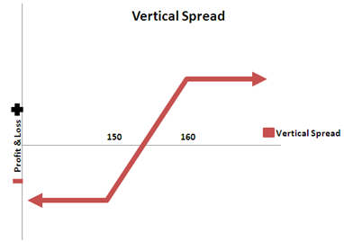
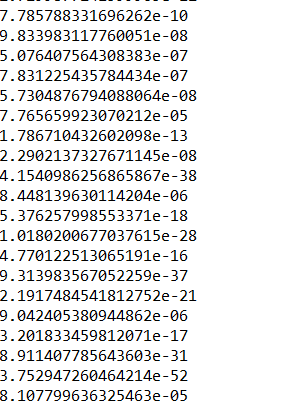

# Vertical_spread_shorting

Introduction:

Who always wanted to know if it was a good idea shorting options  worth a penny? 
Be careful 19/11/2018 “optionseller.com” got bankrupt and much more because of shorting natural gas calls….

The strategy:

Shorting liquid calls and puts naked every thursday, or 1 day before their friday expiration.
Do we blow up with the tail risk?

Conclusion:

-Data was scraped only for a period of 2 months (Ideally for longer if I was able to pay for more)
-It seems to work, however the big drawdown was not observed during the period I scraped the options chains.

Bonus:

What about 1 day options to get the premium over the weekend.
Solution A: scrape options on SPY which is an underlyings with daily options/
Solution B: trying to model the price of an option over the weekend and backtest.
(using Back and Scholes it proved to be an unadapted model for such short-termm, I gave up and conclude that enpirical data was more appropriate)

Proof: option that should be worth ~10 cents are e-10, etc.

